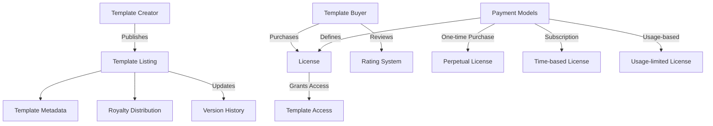

# CodeHash: Smart Contract Template Marketplace

A decentralized marketplace for buying, selling, and licensing reusable Clarity smart contract templates on the Stacks blockchain.

## Overview

CodeHash enables smart contract developers to:
- Publish and monetize verified contract templates
- Purchase ready-to-use contract templates
- Access templates through flexible licensing models
- Build reputation through reviews and ratings
- Track template usage and version history

The platform bridges the gap between experienced Clarity developers and projects seeking reliable smart contract foundations while maintaining high security standards.

## Architecture



### Core Components

1. **Template Registry** - Stores template information and metadata
2. **Licensing System** - Manages different payment and access models
3. **Royalty Distribution** - Handles payments to template creators
4. **Rating System** - Maintains template reviews and ratings
5. **Creator Profiles** - Tracks developer reputation and history

## Contract Documentation

### codehash-marketplace.clar

The main contract managing the CodeHash marketplace functionality.

#### Key Features

- Template creation and management
- Multiple payment models (one-time, subscription, usage-based)
- Royalty distribution system
- License management
- Rating and review system
- Creator profiles

## Getting Started

### Prerequisites

- Clarinet
- Stacks wallet
- STX tokens for transactions

### Installation

1. Clone the repository
2. Install dependencies:
```bash
clarinet install
```

### Basic Usage

#### Creating a Template
```clarity
(contract-call? .codehash-marketplace create-template
    "My Template"
    "Template description"
    u10000 ;; price in uSTX
    u1 ;; payment model (1 = one-time)
    "1.0.0" ;; version
    "category"
    "https://docs.example.com"
    none ;; repository URL
    none ;; preview code
    "MIT License"
)
```

#### Purchasing a Template
```clarity
(contract-call? .codehash-marketplace purchase-template
    u1 ;; template ID
    none ;; usage count (for usage-based licenses)
)
```

## Function Reference

### Public Functions

| Function | Description | Example |
|----------|-------------|---------|
| `create-template` | Creates new template listing | See above |
| `purchase-template` | Purchases template license | See above |
| `set-royalties` | Sets royalty distribution | `(set-royalties u1 (list {...}))` |
| `update-template` | Updates template details | `(update-template u1 ...)` |
| `rate-template` | Submits template rating | `(rate-template u1 u5 "Great!")` |

### Read-Only Functions

- `get-template`: Retrieve template details
- `check-license`: Verify license status
- `get-creator-profile`: Get developer profile
- `get-template-average-rating`: Get template rating

## Development

### Testing

Run the test suite:
```bash
clarinet test
```

### Local Development

1. Start Clarinet console:
```bash
clarinet console
```

2. Deploy contracts:
```clarity
(contract-call? .codehash-marketplace ...)
```

## Security Considerations

### License Validation
- Always verify license status before template usage
- Monitor usage limits for usage-based licenses
- Check license expiration for subscription models

### Payment Protection
- Platform fee automatically calculated and distributed
- Royalty distribution verified before completion
- Minimum price enforcement prevents undervaluation

### Access Control
- Only template creators can modify their listings
- Only valid license holders can submit reviews
- Usage tracking limited to template creators

### Known Limitations

1. No built-in template code verification
2. Rating calculations performed off-chain
3. Limited to 5 royalty recipients per template
4. Fixed subscription duration
5. No partial refunds implemented